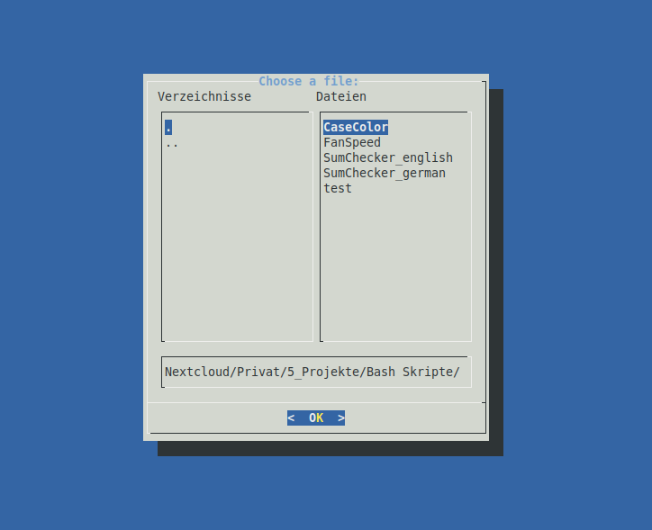
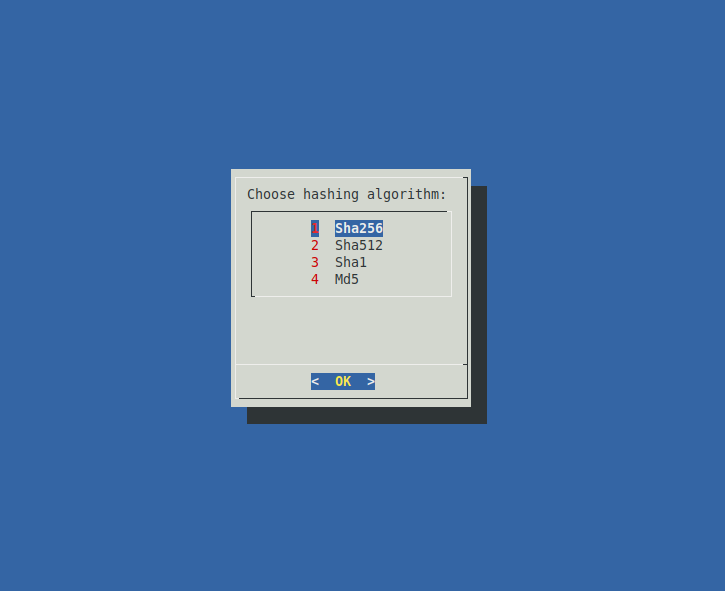
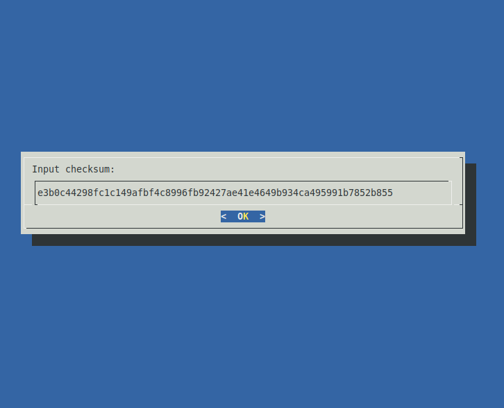
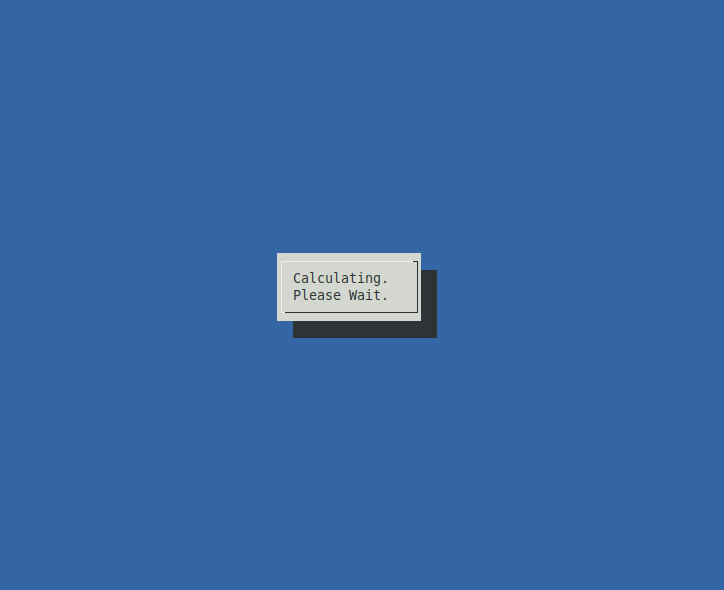
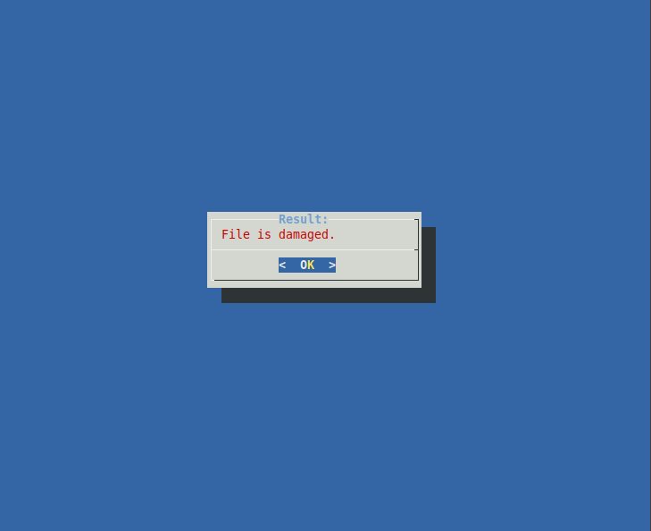

# sumcheck
Simple TUI tool for checking filehashes.

## Function
sumcheck provides an simple and easy way of checking filehashes in the Terminal (example: .iso files). The programm takes the file to check, the hashing method and the checksum as an input. When the programm is done it displays, if the file is OK or if it was damaged.

## Prerequisites
This software needs the following packages installed to work.
* `dialog`
## Install
To install the package follow these steps:
1. Download the Github archive and unpack it or clone it
2. There are two versions. A german and an english version. Choose one and delete the other
3. Rename and move the remaining version with `mv [version_name] /usr/local/bin/sumcheck`

Now you can launch the programm with `sumcheck`

## Pictures
Choosing the file:

Choosing the algorithm:

Inputing the checksum:

Work in progress screen:

Results:

